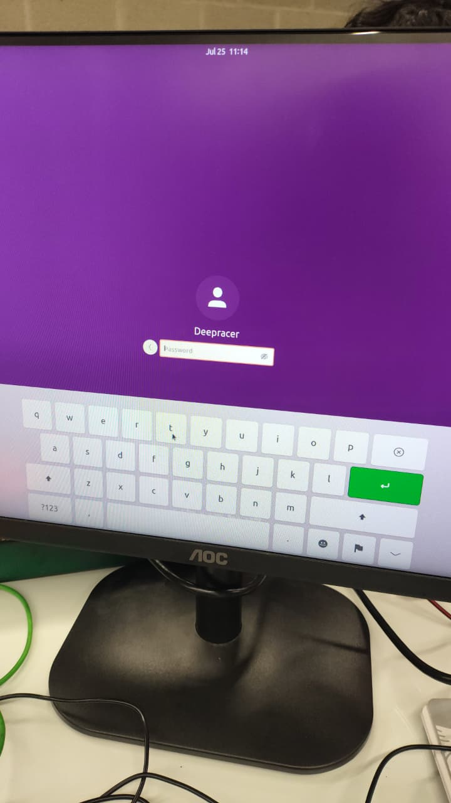
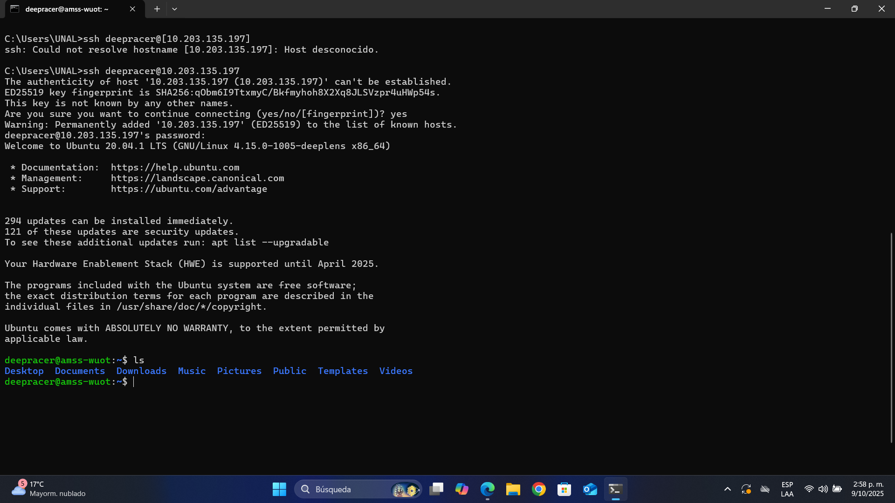

# Acceso al sistema operativo y habilitación del SSH

## Resumen
------
Pasos para acceder al sistema operativo (Ubuntu) del carro y habilitar SSH para acceso remoto.

## Instrucciones
------------

1. Conexión física y encendido
	- Conecta el carro a una pantalla mediante HDMI y conecta un mouse al puerto USB.
	- Enciende el carro (corriente directa o desde una power bank).

	

2. Inicio de sesión
	- El sistema operativo es Ubuntu. Credenciales:
	  - Usuario: deepracer
	  - Contraseña: `Steambog1$`

	

3. Sistema operativo (captura)

	

4. Habilitar SSH
	- Si el SSH no está habilitado y no se puede habilitar mediante la consola del AWS ni la terminal de Ubuntu, generar las claves del servidor ejecutando:

	  ```bash
	  sudo ssh-keygen -A
	  ```

	  Esto crea las claves host (si no existen) para los distintos algoritmos (rsa, ecdsa, ed25519, etc.). Estas claves las usa el servidor SSH para identificarse ante los clientes.

	

5. Comprobar el estado del servicio SSH
	- Para ver si el servicio está corriendo:

	  ```bash
	  sudo systemctl status sshd
	  ```

	

6. Acceso por SSH desde otro equipo
	- Asegúrate de que el equipo desde el que te conectas está en la misma LAN que el deepracer.
	- En el equipo remoto debe estar disponible un cliente SSH (en Linux y macOS viene por defecto; en Windows puedes instalar openSSH o alguna otra herramienta.
	- Con la IP del deepracer, conéctate así:

	  ```bash
	  ssh deepracer@IP_DEL_DEEPRACER
	  ```

	

Notas
-----
- Si no conoces la IP del deepracer, puedes obtenerla con `ip addr` o `ifconfig` en el dispositivo.
- En Windows 10/11 puedes usar `ssh` desde PowerShell: `ssh user@ip`